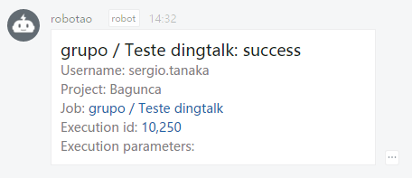

# rundeck plugin
English version of original rundeck plugin https://github.com/nongfenqi/dingtalk-incoming-webhoot-plugin

## How to

1. Clone this repo
2. Build with: `gradle jar`
2. Copy the dingtalk-incoming-webhoot-plugin-1.1.jar to the `RUNDECK_HOME/libexc` directory

